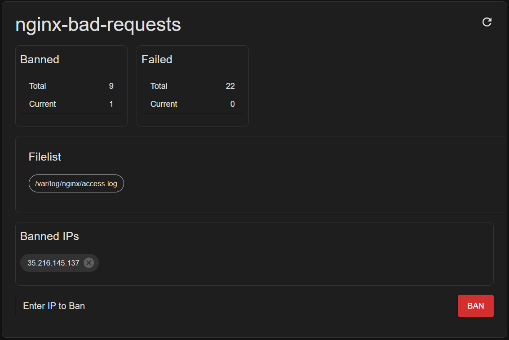

# Fail2ban Web Control

[](https://github.com/oweitman/fail2bancontrol/actions/workflows/dockerhub.yml)
[](https://github.com/oweitman/fail2bancontrol/issues)
[](https://github.com/oweitman/fail2bancontrol/pulls)<br>
[](https://hub.docker.com/r/oweitman/fail2bancontrol)
[](https://hub.docker.com/r/oweitman/fail2bancontrol)
[](https://hub.docker.com/r/oweitman/fail2bancontrol)
[](https://hub.docker.com/r/oweitman/fail2bancontrol)<br>
[](https://github.com/oweitman/fail2bancontrol)
[](https://github.com/oweitman/fail2bancontrol/network)
[](https://github.com/oweitman/fail2bancontrol/stargazers)


## Introduction

This project provides a lightweight **web-based control panel** for managing **Fail2ban**.
It allows you to:

-   View the global status of Fail2ban
-   See active jails and their details
-   Ban/unban IP addresses

The application is containerized with Docker and connects directly to the `fail2ban.sock` socket file shared from your running Fail2ban instance.

## Installation

There are two installation options:

---

### A) Directly from Docker Hub

#### 1) Provide the Fail2ban socket

You must share the Fail2ban socket file with this container so it can communicate with the Fail2ban service.

Mount the directory containing the socket from inside the fail2ban container. if fail2ban is installed in the host-system you can skip this part and mount the path directly,

```yaml
volumes:
    - /path/to/directory:/var/run/fail2ban
    - ./path/to/logfile:/path/in/container/logfile
```

#### 2) Run the container

##### Option A – Docker Compose

`docker-compose.dockerhub` (rename it to docker-compose) example:

```yaml
version: '3.9'

services:
    fail2bancontrol:
        image: oweitman/fail2bancontrol
        container_name: fail2bancontrol

        ports:
            - '9191:9000'
        volumes:
            # Include sock file from host (adjust path!)
            - ./path/to/socket.sock:/path/in/container/socket.sock
            # Include log file from host (adjust path!)
            - ./path/to/logfile:/path/in/container/logfile
        environment:
            TZ: Europe/Berlin
        restart: unless-stopped
```

Start:

```bash
docker compose up -d
```

---

##### Option B – Direct `docker run`

```bash
docker run -d \
  --name fail2bancontrol \
  -p 9191:9000 \
  -e TZ=Europe/Berlin \
  -v /path/to/directory:/var/run/fail2ban \
  -v /path/to/logfile:/path/in/container/logfile \
  --restart unless-stopped \
  oweitman/fail2bancontrol
```

#### 3) Access the UI

Open:

```
http://<host>:9191
```

---

### B) Container is created locally

#### 1) Clone the repository

```bash
git clone https://github.com/oweitman/fail2bancontrol fail2bancontrol
cd fail2bancontrol
```

---

#### 2) Build the Docker image

Create a file `build-image.sh` in the repository root with the following content:

```bash
#!/usr/bin/env bash
docker build -t fail2bancontrol .
```

Make it executable and run:

```bash
chmod +x build-image.sh
./build-image.sh
```

---

#### 3) Provide the Fail2ban socket

You must share the Fail2ban socket file with this container so it can communicate with the Fail2ban service.

Mount the directory containing the socket from inside the fail2ban container. if fail2ban is installed in the host-system you can skip this part and mount the path directly,

```yaml
volumes:
    - /path/to/directory:/var/run/fail2ban
    - ./path/to/logfile:/path/in/container/logfile
```

#### 4) Run the container

##### Option A – Docker Compose

`docker-compose.local` (rename it to docker-compose) example:

```yaml
version: '3.9'
services:
    fail2bancontrol:
        image: fail2bancontrol:latest
        container_name: fail2bancontrol

        ports:
            - '9191:9000'

        volumes:
            # directory mount
            - '/path/to/directory:/var/run/fail2ban'
            - ./path/to/logfile:/path/in/container/logfile

        environment:
            TZ: Europe/Berlin

        restart: unless-stopped
```

Start:

```bash
docker compose up -d
```

---

##### Option B – Direct `docker run`

```bash
docker run -d \
  --name fail2bancontrol \
  -p 9191:9000 \
  -e TZ=Europe/Berlin \
  -v /path/to/directory:/var/run/fail2ban \
  -v /path/to/logfile:/path/in/container/logfile \
  --restart unless-stopped \
  fail2bancontrol:latest
```

#### 5) Access the UI

Open:

```
http://<host>:9191
```

---

## Features

### See active jails and their details



-   Number of current and total number of blocked and failed IPs
-   All referred Files of this jail.
-   all current banned IPs.
-   Unban an IP address
-   Ban an IP address

### Access the log files of a jail

If the respective log file has been mapped to the fail2bancontrol container sld volume with the same path, this log file can be displayed and continuously monitored.

Example:

```yaml
volumes:
    - ./path/to/socket.sock:/path/in/container/socket.sock
    - ./path/to/logfile:/path/in/container/logfile
```

## Available API

### GET `/api/status`

Returns the **global** fail2ban status: number of jails and their names.

-   **Response 200**

    Body:

    ```json
    {
        "jails": 3,
        "list": ["sshd", "nginx-http-auth", "recidive"]
    }
    ```

-   **Errors**

    -   `500`: `{ "error": "<message>" }` if the socket call fails

---

### GET `/api/jails`

Returns the **array of jail names**.

-   **Response 200**

    -   Body: `["sshd", "nginx-http-auth", ...]`

-   **Errors**

    -   `500`: `{ "error": "<message>" }`

---

### GET `/api/jail/{jail}/status`

Returns detailed status for a specific jail.

-   **Path params**

    -   `jail` — jail name (case-sensitive as known to fail2ban)

-   **Response 200**

    -   Body:

        ```json
        {
            "filter": {
                "currentlyFailed": 2,
                "totalFailed": 431,
                "fileList": [
                    { "path": "/var/log/auth.log", "exists": true },
                    { "path": "/var/log/secure", "exists": false }
                ]
            },
            "actions": {
                "currentlyBanned": 1,
                "totalBanned": 37,
                "bannedIPList": ["203.0.113.7"]
            }
        }
        ```

-   **Errors**

    -   `500`: `{ "error": "<message>" }` (e.g., unknown jail, socket error)

---

### POST `/api/jail/{jail}/ban`

Bans a single IPv4 address in the given jail.

-   **Path params**

    -   `jail` — jail name

-   **Request Body (JSON)**

    ```json
    { "ip": "198.51.100.42" }
    ```

    -   Must be a **valid IPv4** address (IPv6 is not accepted by this API).

-   **Response 200**

    ```json
    { "result": "<fail2ban textual response>" }
    ```

-   **Errors**

    -   `400`: `{ "error": "A valid IPv4 address must be provided in the body as \"ip\"" }`
    -   `500`: `{ "error": "<message>" }` (socket or fail2ban error)
    -   `404`: `{ "error": "Not found4" }` if the route does not match

---

### POST `/api/jail/{jail}/unban`

Unbans a single IPv4 address in the given jail.

-   **Path params**

    -   `jail` — jail name

-   **Request Body (JSON)**

    ```json
    { "ip": "198.51.100.42" }
    ```

-   **Response 200**

    ```json
    { "result": "<fail2ban textual response>" }
    ```

-   **Errors**

    -   Same as for **ban**.

---

### GET `/api/file?path=<abs-path>&lines=<n>`

Reads a file from the host filesystem.

-   **Query params**

    -   `path` (required): absolute or relative path (resolved to absolute); must point to a regular file.
    -   `lines` (optional, integer):

        -   `0` or omitted → **entire file**
        -   Positive `n` → **first _n_ lines**
        -   Negative `-n` → **last _n_ lines**

-   **Response 200**

    -   Body:

        ```json
        {
            "path": "/var/log/nginx/access.log",
            "exists": true,
            "lines": ["<line 1>", "<line 2>", "..."]
        }
        ```

-   **Errors**

    -   `404`: `{ "error": "File not found", "path": "<given path>" }`
    -   `500`: `{ "error": "<message>" }` (I/O error, encoding error)

> Security note: The code resolves to an absolute path and requires the path to exist and be a file. There is no allow-list; consider hardening behind a proxy.

## Notes & Troubleshooting

-   **Permission denied**: If you get this error, your container user may not have permissions to read the socket.
    Quick fix: run the container as `root` (default in Dockerfile).
    Alternative: adjust socket file permissions or match the group ID inside the container.

-   **Verify the socket inside the container**:

    ```bash
    docker exec -it fail2bancontrol ls -l /var/run/fail2ban
    ```

-   **Port mapping**: The internal app port is controlled by `PORT` (default `9000`). External port is defined in Docker Compose or `docker run` (`9191:9000` in examples).

## Changelog

<!-- CHANGELOG:INSERT -->
### v1.5.1 — 2025-08-28

-   recreate frontend sources
-   improve release script

### v1.5.0 – 2025-08-28

-   add version
-   add workflow actions for release and version

### Version 1.4.0

-   improve backend logic für prod and dev
-   add footer with links

### Version 1.3.0

-   automate docker push

### Version 1.2.0

-   Feature FileView

### Version 1.1.0

-   Move gui to mui/react

### Version 1.0.0

-   Initial release
